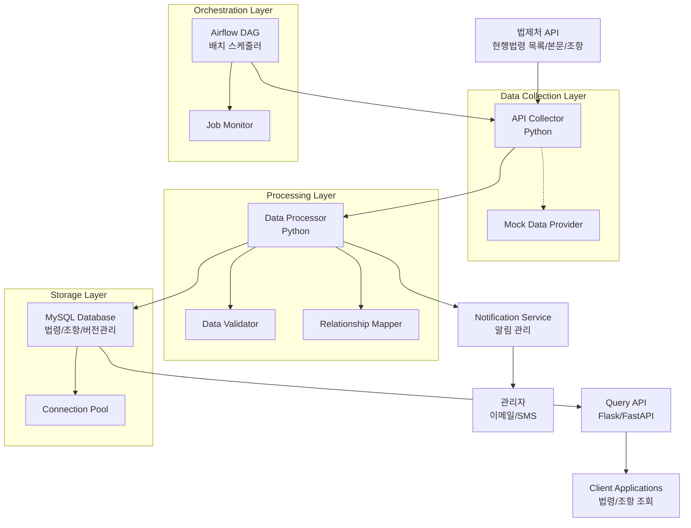
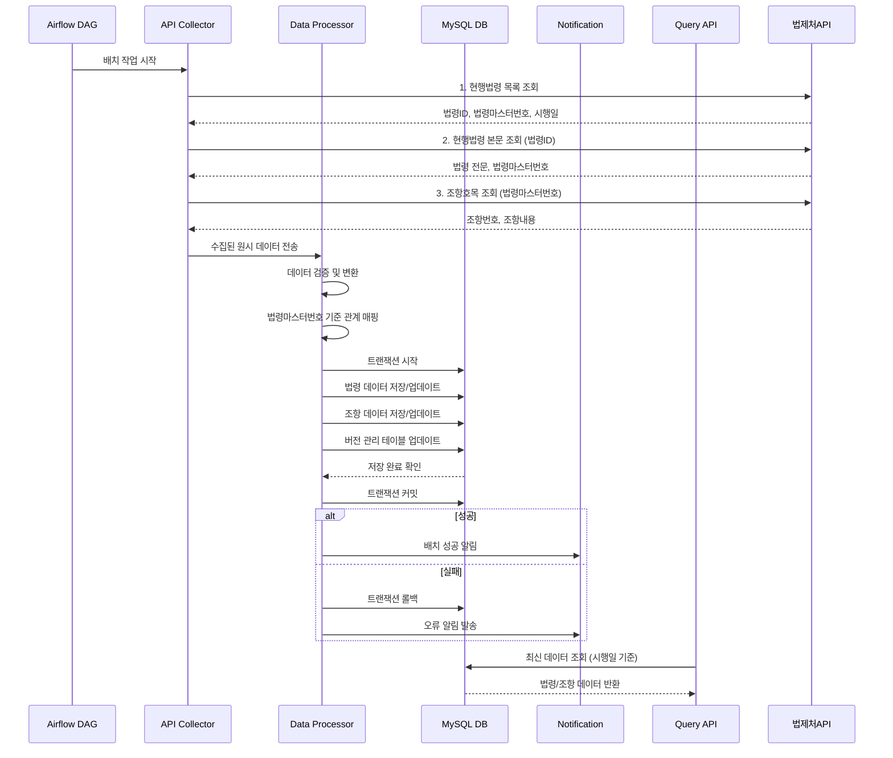

# Design Document

## Overview

법제처 API (https://open.law.go.kr/LSO/openApi/guideList.do)를 활용한 데이터 파이프라인은 Python 기반으로 구축되며, MySQL 데이터베이스와 Airflow를 활용한 배치 처리 시스템입니다. 

**핵심 설계 원칙**:
- 법령ID (고유, 불변) vs 법령마스터번호 (개정시 변경) 기반 데이터 관리
- **시행일 기준 최신성 보장**: 공포일이 아닌 시행일을 기준으로 현재 시점에서 실제 법적 효력이 있는 최신 법령 제공
- 법령마스터번호 키를 통한 법령-조항 관계 매핑
- 실시간 무중단 서비스 지원
- 효율적인 배치 처리 및 오류 관리

**시행일 vs 공포일 구분**:
- **공포일**: 법령이 공식 발표된 날짜 (아직 효력 없음)
- **시행일**: 법령이 실제 효력을 발생하는 날짜 (실제 적용 시점)
- **최신성 판단**: 현재 시점에서 시행일이 도래한 법령 중 가장 최근 시행일을 가진 버전을 최신으로 판단

## Architecture

### High-Level Architecture



### Data Flow Architecture



## Components and Interfaces

### 1. API Collector Service

**책임**: 법제처 API 3개 엔드포인트로부터 데이터 수집 및 초기 검증

**주요 기능**:
- 현행법령 목록 조회 API 호출 (법령ID, 법령마스터번호, 시행일 수집)
- 증분 업데이트를 위한 최신 데이터 필터링 (시행일 기준)
- 현행법령 본문 조회 API 호출 (변경된 법령ID만 대상)
- 현행법령 본문 조항호목 조회 API 호출 (새로운 법령마스터번호만 대상)
- API 호출 실패 시 재시도 로직
- 수집 상태 및 성능 모니터링

**인터페이스**:
```python
class LegalAPICollector:
    def collect_law_list(self, last_sync_date: Optional[date] = None) -> List[LawListItem]:
        """현행법령 목록 조회 - 증분 업데이트를 위해 최신 데이터만 필터링"""
        
    def get_updated_laws(self, last_sync_date: date) -> List[str]:
        """마지막 동기화 이후 업데이트된 법령ID 목록 조회"""
        
    def collect_law_content(self, law_id: str) -> LawContent:
        """현행법령 본문 조회 - 변경된 법령ID만 대상으로 수집"""
        
    def collect_law_articles(self, law_master_no: str) -> List[LawArticle]:
        """현행법령 조항호목 조회 - 새로운 법령마스터번호만 대상으로 수집"""
        
    def collect_incremental_updates(self, last_sync_date: date) -> IncrementalUpdateResult:
        """증분 업데이트 - 최신 데이터만 효율적으로 수집"""
        
    def health_check(self) -> APIHealthStatus:
        """API 연결 상태 확인"""

@dataclass
class LawListItem:
    law_id: str
    law_master_no: str
    law_name: str
    enforcement_date: date
    
@dataclass  
class LawContent:
    law_id: str
    law_master_no: str
    law_name: str
    content: str
    enforcement_date: date
    
@dataclass
class LawArticle:
    law_master_no: str
    article_no: str
    article_title: str
    article_content: str
    parent_article_no: Optional[str]

@dataclass
class IncrementalUpdateResult:
    updated_laws: List[LawListItem]
    new_law_master_nos: List[str]
    total_updated_count: int
    last_update_date: date
```

### 2. Data Processor Service

**책임**: 수집된 데이터의 변환, 검증, 법령마스터번호 기준 관계 매핑

**주요 기능**:
- 증분 업데이트된 법령 데이터 처리 및 검증
- 법령ID 고유성 검증 및 법령마스터번호 버전 관리
- 시행일 기준 최신성 판단 및 업데이트
- 법령마스터번호 키를 통한 법령-조항 관계 매핑
- 데이터 정합성 검증 및 트랜잭션 관리
- 변경된 데이터만 효율적으로 처리

**인터페이스**:
```python
class LegalDataProcessor:
    def process_incremental_update(self, update_result: IncrementalUpdateResult) -> ProcessingResult:
        """증분 업데이트 데이터 처리 - 변경된 데이터만 효율적으로 처리"""
        
    def process_law_data(self, law_content: LawContent, 
                        existing_versions: List[LawVersion]) -> ProcessedLaw:
        """법령 데이터 처리 - 버전 관리 및 최신성 검증"""
        
    def process_article_data(self, articles: List[LawArticle], 
                           law_master_no: str) -> List[ProcessedArticle]:
        """조항 데이터 처리 - 법령마스터번호 기준 관계 설정"""
        
    def is_newer_version(self, new_enforcement_date: date, 
                        existing_enforcement_date: date, 
                        current_date: date = None) -> bool:
        """시행일 비교를 통한 최신 버전 판단 - 현재 시점에서 실제 효력이 있는 법령 기준"""
        
    def determine_latest_version(self, law_id: str, 
                               versions: List[LawVersion], 
                               reference_date: date = None) -> Optional[str]:
        """시행일 기준 최신 법령마스터번호 결정 - 기준일 시점에서 실제 효력이 있는 최신 법령"""
        
    def create_law_version(self, law_id: str, law_master_no: str, 
                          enforcement_date: date) -> LawVersion:
        """새로운 법령 버전 생성"""
        
    def update_relationships(self, law_master_no: str, 
                           articles: List[ProcessedArticle]) -> None:
        """법령마스터번호 기준 관계 업데이트"""

@dataclass
class ProcessedLaw:
    law_id: str
    law_master_no: str
    law_name: str
    content: str
    enforcement_date: date
    is_latest: bool
    version_no: int
    
@dataclass
class ProcessedArticle:
    law_master_no: str
    article_no: str
    article_title: str
    article_content: str
    parent_article_no: Optional[str]
    article_order: int
    
@dataclass
class LawVersion:
    law_id: str
    law_master_no: str
    version_no: int
    enforcement_date: date
    is_latest: bool
```

### 3. Database Layer

**책임**: 데이터 영구 저장 및 관계 관리

**MySQL 스키마 설계**:
```sql
-- 법령 기본 정보 테이블
CREATE TABLE laws (
    id BIGINT PRIMARY KEY AUTO_INCREMENT,
    law_id VARCHAR(50) NOT NULL COMMENT '법령ID - 각 법령마다 고유하게 존재',
    law_master_no VARCHAR(50) NOT NULL COMMENT '법령마스터번호 - 법령 개정시마다 변경',
    law_name VARCHAR(500) NOT NULL,
    law_type VARCHAR(100),
    promulgation_date DATE COMMENT '공포일',
    enforcement_date DATE NOT NULL COMMENT '시행일 - 법령이 실제 효력을 발생하는 날짜 (최신성 판단 기준)',
    content LONGTEXT COMMENT '법령 본문',
    is_latest BOOLEAN DEFAULT FALSE COMMENT '최신 버전 여부',
    created_at TIMESTAMP DEFAULT CURRENT_TIMESTAMP,
    updated_at TIMESTAMP DEFAULT CURRENT_TIMESTAMP ON UPDATE CURRENT_TIMESTAMP,
    
    UNIQUE KEY unique_law_master (law_master_no),
    INDEX idx_law_id (law_id),
    INDEX idx_law_id_latest (law_id, is_latest),
    INDEX idx_enforcement_date (enforcement_date),
    INDEX idx_latest_laws (is_latest, enforcement_date)
) COMMENT='법령 기본 정보 - 법령마스터번호 기준 버전 관리';

-- 조항 상세 정보 테이블  
CREATE TABLE articles (
    id BIGINT PRIMARY KEY AUTO_INCREMENT,
    law_master_no VARCHAR(50) NOT NULL COMMENT '법령마스터번호 - 법령과 조항 매핑 키',
    article_no VARCHAR(100) NOT NULL COMMENT '조항번호',
    article_title VARCHAR(1000) COMMENT '조항 제목',
    article_content LONGTEXT NOT NULL COMMENT '조항 내용',
    parent_article_no VARCHAR(100) COMMENT '상위 조항번호',
    article_order INT DEFAULT 0 COMMENT '조항 순서',
    created_at TIMESTAMP DEFAULT CURRENT_TIMESTAMP,
    updated_at TIMESTAMP DEFAULT CURRENT_TIMESTAMP ON UPDATE CURRENT_TIMESTAMP,
    
    FOREIGN KEY (law_master_no) REFERENCES laws(law_master_no) ON DELETE CASCADE,
    INDEX idx_law_master_no (law_master_no),
    INDEX idx_article_no (article_no),
    INDEX idx_parent_article (parent_article_no),
    UNIQUE KEY unique_article (law_master_no, article_no)
) COMMENT='조항 상세 정보 - 법령마스터번호 기준으로 법령과 매핑';

-- 법령 버전 이력 관리 테이블
CREATE TABLE law_versions (
    id BIGINT PRIMARY KEY AUTO_INCREMENT,
    law_id VARCHAR(50) NOT NULL COMMENT '법령ID - 불변 식별자',
    law_master_no VARCHAR(50) NOT NULL COMMENT '법령마스터번호 - 버전별 식별자',
    version_no INT NOT NULL COMMENT '버전 번호',
    enforcement_date DATE NOT NULL COMMENT '시행일',
    is_latest BOOLEAN DEFAULT FALSE COMMENT '최신 버전 여부',
    created_at TIMESTAMP DEFAULT CURRENT_TIMESTAMP,
    
    FOREIGN KEY (law_master_no) REFERENCES laws(law_master_no) ON DELETE CASCADE,
    UNIQUE KEY unique_version (law_id, version_no),
    UNIQUE KEY unique_law_master (law_master_no),
    INDEX idx_law_id_latest (law_id, is_latest),
    INDEX idx_enforcement_date (enforcement_date)
) COMMENT='법령 버전 이력 - 법령 개정 추적 및 최신성 관리';

-- 배치 작업 이력 테이블
CREATE TABLE batch_jobs (
    id BIGINT PRIMARY KEY AUTO_INCREMENT,
    job_id VARCHAR(100) NOT NULL,
    job_type ENUM('FULL_SYNC', 'INCREMENTAL_SYNC', 'VALIDATION') NOT NULL,
    status ENUM('PENDING', 'RUNNING', 'SUCCESS', 'FAILED') NOT NULL,
    start_time TIMESTAMP NOT NULL,
    end_time TIMESTAMP NULL,
    last_sync_date DATE COMMENT '마지막 동기화 기준일',
    processed_laws INT DEFAULT 0,
    processed_articles INT DEFAULT 0,
    error_count INT DEFAULT 0,
    error_details TEXT,
    created_at TIMESTAMP DEFAULT CURRENT_TIMESTAMP,
    
    UNIQUE KEY unique_job_id (job_id),
    INDEX idx_job_type_status (job_type, status),
    INDEX idx_start_time (start_time),
    INDEX idx_last_sync_date (last_sync_date)
) COMMENT='배치 작업 실행 이력 및 증분 업데이트 추적';

-- 동기화 상태 관리 테이블
CREATE TABLE sync_status (
    id INT PRIMARY KEY AUTO_INCREMENT,
    sync_type ENUM('FULL', 'INCREMENTAL') NOT NULL,
    last_sync_date DATE NOT NULL COMMENT '마지막 성공한 동기화 날짜',
    last_enforcement_date DATE COMMENT '마지막으로 처리된 시행일',
    total_laws_count INT DEFAULT 0,
    updated_at TIMESTAMP DEFAULT CURRENT_TIMESTAMP ON UPDATE CURRENT_TIMESTAMP,
    
    UNIQUE KEY unique_sync_type (sync_type)
) COMMENT='동기화 상태 추적 - 증분 업데이트 기준점 관리';
```

### 4. Data Storage Service

**책임**: MySQL 데이터베이스 연동 및 데이터 영구 저장

**주요 기능**:
- 법령/조항 데이터 CRUD 연산
- 트랜잭션 관리 및 데이터 일관성 보장
- 법령마스터번호 기준 관계 관리
- 최신 버전 플래그 관리
- 무중단 서비스를 위한 배치 업데이트

**인터페이스**:
```python
class LegalDataRepository:
    def save_law(self, law: ProcessedLaw) -> bool:
        """법령 데이터 저장/업데이트"""
        
    def save_articles(self, articles: List[ProcessedArticle]) -> bool:
        """조항 데이터 저장/업데이트"""
        
    def get_existing_law_versions(self, law_id: str) -> List[LawVersion]:
        """기존 법령 버전 조회"""
        
    def update_latest_flags(self, law_id: str, latest_law_master_no: str) -> bool:
        """최신 버전 플래그 업데이트"""
        
    def get_last_sync_date(self, sync_type: str) -> Optional[date]:
        """마지막 동기화 날짜 조회"""
        
    def update_sync_status(self, sync_type: str, sync_date: date, 
                          total_count: int) -> bool:
        """동기화 상태 업데이트"""
        
    def begin_transaction(self) -> None:
        """트랜잭션 시작"""
        
    def commit_transaction(self) -> None:
        """트랜잭션 커밋"""
        
    def rollback_transaction(self) -> None:
        """트랜잭션 롤백"""

@dataclass
class ProcessingResult:
    success: bool
    processed_laws: int
    processed_articles: int
    error_count: int
    error_messages: List[str]
    processing_time_seconds: float
```

### 5. Notification Service

**책임**: 오류 및 상태 알림 관리

**주요 기능**:
- 이메일/SMS 알림 발송
- 알림 템플릿 관리
- 알림 이력 추적
- 긴급도별 알림 분류

**인터페이스**:
```python
class NotificationService:
    def send_error_alert(self, error: Exception, context: Dict) -> None
    def send_batch_completion_notice(self, result: BatchResult) -> None
    def send_critical_alert(self, message: str) -> None
    def get_notification_history(self, start_date: date, end_date: date) -> List[Notification]
```

## Data Models

### Core Data Models

```python
from dataclasses import dataclass
from datetime import date, datetime
from typing import Optional, List
from enum import Enum

class JobStatus(Enum):
    PENDING = "PENDING"
    RUNNING = "RUNNING" 
    SUCCESS = "SUCCESS"
    FAILED = "FAILED"

class JobType(Enum):
    FULL_SYNC = "FULL_SYNC"
    INCREMENTAL_SYNC = "INCREMENTAL_SYNC"
    VALIDATION = "VALIDATION"

@dataclass
class Law:
    """법령 기본 정보 모델"""
    law_id: str  # 법령ID - 각 법령마다 고유하게 존재
    law_master_no: str  # 법령마스터번호 - 법령 개정시마다 변경
    law_name: str
    law_type: Optional[str]
    promulgation_date: Optional[date]
    enforcement_date: date  # 시행일 - 법령이 실제 효력을 발생하는 날짜 (최신성 판단 기준)
    content: Optional[str]
    is_latest: bool  # 최신 버전 여부
    version_no: int
    articles: Optional[List['Article']] = None

@dataclass
class Article:
    """조항 상세 정보 모델"""
    law_master_no: str  # 법령마스터번호 - 법령과 조항 매핑 키
    article_no: str
    article_title: Optional[str]
    article_content: str
    parent_article_no: Optional[str]
    article_order: int

@dataclass
class LawVersion:
    """법령 버전 관리 모델"""
    law_id: str  # 법령ID - 불변 식별자
    law_master_no: str  # 법령마스터번호 - 버전별 식별자
    version_no: int
    enforcement_date: date
    is_latest: bool

@dataclass
class BatchJob:
    """배치 작업 모델"""
    job_id: str
    job_type: JobType
    status: JobStatus
    start_time: datetime
    end_time: Optional[datetime]
    processed_laws: int
    processed_articles: int
    error_count: int
    error_details: Optional[str]

@dataclass
class APIHealthStatus:
    """API 상태 모니터링 모델"""
    is_healthy: bool
    response_time_ms: int
    last_check: datetime
    error_message: Optional[str]

@dataclass
class ValidationResult:
    """데이터 검증 결과 모델"""
    is_valid: bool
    error_messages: List[str]
    warning_messages: List[str]
    validated_count: int
```

## Error Handling

### Error Categories

1. **API 연동 오류**
   - 네트워크 타임아웃
   - API 응답 오류 (4xx, 5xx)
   - 데이터 형식 오류

2. **데이터 처리 오류**
   - 데이터 검증 실패
   - 중복 키 오류
   - 관계 무결성 위반

3. **시스템 오류**
   - 데이터베이스 연결 실패
   - 메모리 부족
   - 디스크 공간 부족

### Error Handling Strategy

```python
class ErrorHandler:
    def handle_api_error(self, error: APIError) -> RetryAction
    def handle_data_error(self, error: DataError) -> ProcessingAction
    def handle_system_error(self, error: SystemError) -> SystemAction
    
    def should_retry(self, error: Exception, attempt_count: int) -> bool
    def calculate_backoff_delay(self, attempt_count: int) -> int
```

## Testing Strategy

### Unit Testing
- 각 컴포넌트별 독립적인 단위 테스트
- Mock 객체를 활용한 의존성 격리
- 데이터 변환 로직 검증

### Integration Testing
- API 연동 테스트 (Mock API 서버 활용)
- 데이터베이스 연동 테스트
- 컴포넌트 간 인터페이스 테스트

### End-to-End Testing
- 전체 파이프라인 플로우 테스트
- 배치 작업 시나리오 테스트
- 오류 상황 시뮬레이션

### Performance Testing
- 대용량 데이터 처리 성능 테스트
- 동시 접근 부하 테스트
- 메모리 사용량 모니터링

## Airflow DAG 설계

### 배치 작업 워크플로우

```python
from airflow import DAG
from airflow.operators.python import PythonOperator
from datetime import datetime, timedelta

# DAG 정의
legal_data_pipeline_dag = DAG(
    'legal_data_pipeline',
    description='법제처 API 데이터 파이프라인',
    schedule_interval='0 2 * * *',  # 매일 새벽 2시 실행
    start_date=datetime(2024, 1, 1),
    catchup=False,
    max_active_runs=1
)

# Task 정의
check_last_sync = PythonOperator(
    task_id='check_last_sync',
    python_callable=check_last_sync_task,
    dag=legal_data_pipeline_dag
)

collect_updated_laws = PythonOperator(
    task_id='collect_updated_laws',
    python_callable=collect_updated_laws_task,
    dag=legal_data_pipeline_dag
)

collect_law_contents = PythonOperator(
    task_id='collect_law_contents', 
    python_callable=collect_law_contents_task,
    dag=legal_data_pipeline_dag
)

collect_articles = PythonOperator(
    task_id='collect_articles',
    python_callable=collect_articles_task, 
    dag=legal_data_pipeline_dag
)

process_and_store = PythonOperator(
    task_id='process_and_store',
    python_callable=process_and_store_task,
    dag=legal_data_pipeline_dag
)

update_sync_status = PythonOperator(
    task_id='update_sync_status',
    python_callable=update_sync_status_task,
    dag=legal_data_pipeline_dag
)

# Task 의존성 설정 - 증분 업데이트 플로우
check_last_sync >> collect_updated_laws >> collect_law_contents >> collect_articles >> process_and_store >> update_sync_status
```

## Deployment and Operations

### 프로젝트 구조
```
legal-data-pipeline/
├── src/
│   ├── collectors/
│   │   └── legal_api_collector.py
│   ├── processors/
│   │   ├── data_processor.py
│   │   └── incremental_processor.py
│   ├── database/
│   │   ├── models.py
│   │   ├── repository.py
│   │   ├── connection.py
│   │   └── migrations/
│   ├── notifications/
│   │   └── notification_service.py
│   └── airflow/
│       └── dags/
│           └── legal_pipeline_dag.py
├── scripts/
│   ├── create_database.py
│   ├── run_batch_job.py
│   └── data_validation.py
├── docker/
│   ├── Dockerfile.api
│   ├── Dockerfile.worker
│   └── docker-compose.yml
├── config/
│   ├── database.yaml
│   ├── api_config.yaml
│   └── airflow.cfg
└── requirements.txt
```

### Docker 컨테이너 구성
```dockerfile
# Dockerfile.pipeline - 데이터 파이프라인 서비스
FROM python:3.9-slim
WORKDIR /app
COPY requirements.txt .
RUN pip install -r requirements.txt
COPY src/ ./src/
CMD ["python", "-m", "collectors.legal_api_collector"]

# Dockerfile.worker - 배치 작업 워커
FROM python:3.9-slim
WORKDIR /app
COPY requirements.txt .
RUN pip install -r requirements.txt
COPY src/ ./src/
CMD ["python", "-m", "processors.data_processor"]
```

### 모니터링 및 로깅
- **애플리케이션 로그**: 구조화된 JSON 로그 형식
- **성능 메트릭**: API 응답 시간, 배치 처리 시간, 데이터베이스 성능
- **알림 시스템**: 이메일/SMS를 통한 오류 및 상태 알림
- **대시보드**: Airflow UI를 통한 배치 작업 모니터링

### 백업 및 복구
- **데이터베이스 백업**: 일일 자동 백업 (mysqldump)
- **장애 복구**: 트랜잭션 롤백 및 데이터 일관성 검증
- **재처리 메커니즘**: 실패한 배치 작업 재실행 기능